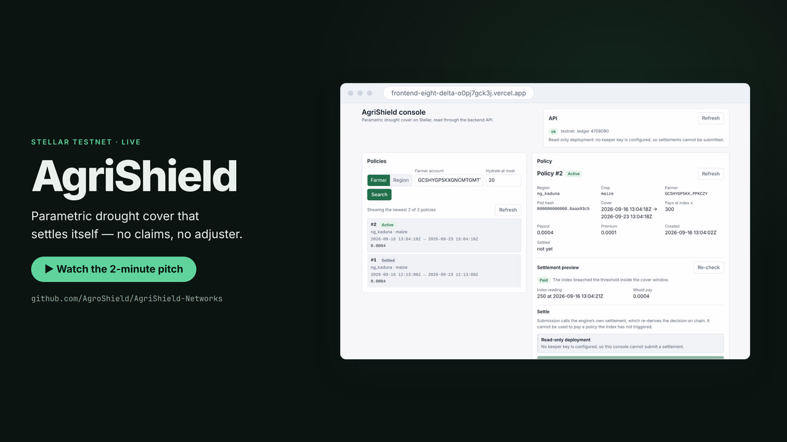

# AgriShield-Networks

[](https://github.com/AgroShield/AgriShield-Networks/releases/download/v1.0.0/agrishield-demo.mp4)
[](https://github.com/AgroShield/AgriShield-Networks/actions)
[](#live-deployment)
[](LICENSE)

AgriShield is an open-source Stellar/Soroban parametric insurance platform that
automatically pays smallholder farmers when oracle-verified weather or satellite
data confirms a drought or flood, replacing slow, fraud-prone manual claims with
fast, transparent, trigger-based payouts.

Pre-1.0, and deployed to testnet only. See [Live deployment](#live-deployment)
for the addresses, the transactions that prove they work, and the console.

| | |
| --- | --- |
| Console | **https://frontend-eight-delta-o0pj7gck3j.vercel.app** |
| API | **https://agrishield-backend-phi.vercel.app** — live, read-only, no signing key configured |
| Network | Stellar testnet |
| Contracts | 4 deployed, wired and initialized — [proof](#live-deployment) |
| Tests | 279 contracts · 88 backend · 28 frontend |
| Demo | **▶ [2-minute walkthrough](https://github.com/AgroShield/AgriShield-Networks/releases/download/v1.0.0/agrishield-demo.mp4)** — 1080p, 10.5 MB, narrated |

## Watch the pitch

[](https://github.com/AgroShield/AgriShield-Networks/releases/download/v1.0.0/agrishield-demo.mp4)

**▶ [Download the MP4](https://github.com/AgroShield/AgriShield-Networks/releases/download/v1.0.0/agrishield-demo.mp4)** — 2:13, 1920×1080, 10.5 MB.

Two minutes on the problem, the mechanism and the evidence. It is recorded
against the **live console reading Stellar testnet** and the contracts deployed
below, not against slides or a mock: the policy it settles a claim on is real
chain state, and the test output on screen is this tree's. Every frame can be
traced back to a command in [docs/video](docs/video), which is how it is
regenerated rather than re-recorded.

## Features

### Parametric cover, settled without a claim

A policy pays on an observation, not on an application. Cover is bought with a
window and a threshold; if the region's finalized index is at or below the
threshold inside that window, the farmer is paid without filing anything, and
without anyone at the insurer deciding whether to.

- **Windowed cover.** The trigger only counts readings inside
  `[coverage_start, coverage_end)`. A breach observed before cover began or after
  it closed cannot trigger payment, which is what stops a farmer buying cover
  against weather they have already seen.
- **Earliest qualifying reading decides.** Not the latest, so what a policy pays
  never depends on how many observations happened to be published afterwards.
- **Deterministic preview.** `evaluate` runs the same pure decision procedure
  settlement does, so a keeper can sweep every live policy in a region each round
  and submit only the ones that will do something. The preview cannot disagree
  with the state change it previews, because it is the same function.

### Parameters a single mispriced product cannot abuse

Validated at mint time, before anything is escrowed:

- coverage windows of 7 to 180 days — short enough to limit adverse selection
  around a known forecast, long enough to fund;
- the payout is capped at **5× the premium**, so even with a 1-in-5 trigger
  probability the worst case is break-even on premium income alone;
- one active policy per plot at a time: overlapping windows on the same
  `plot_hash` are rejected, and a plot's index is capped so the overlap scan
  stays affordable;
- premium and payout must be positive, the threshold non-negative.

### An oracle no single party can move

Readings finalize only when `threshold` distinct authorized signers submit the
same `(region, timestamp, index_value)` triple.

- **A vote cannot be split.** A signer submitting a different value for the same
  instant is rejected rather than silently forming a second consensus.
- **Readings are monotonic.** An older observation can never overwrite newer
  state.
- **A pair finalizes at most once**, and re-submissions afterwards are refused.
- **History is bounded** per region, so a publisher cannot grow storage without
  bound, and **the signer set is capped** at 15 so the approval handshake stays
  cheap to verify.
- **The threshold cannot be made unsatisfiable.** Removing a signer that would
  leave the threshold unreachable reverts, because that would permanently freeze
  the region's settlements.

### Money that cannot be quietly moved

- **The engine holds nothing.** It has no funds and no authority of its own; it
  can only do what the registry and the pool permit a *registered* engine to do.
- **Callers are verified as contracts, not named.** The registry and the pool
  each check that the invoking contract *is* their registered engine, which a
  contract address can only satisfy by being in the call stack — so settlement
  cannot be forged by passing an address.
- **Reserves are real.** The pool keeps no internal ledger; its balance is the
  contract's own token balance, so accounting cannot drift from reality.
- **Committed capital is out of reach.** Admin withdrawals are rejected unless
  the solvency floor (default **120%** of outstanding liability) still holds
  afterwards. The admin cannot mint tokens and cannot pay itself.
- **Liability is bookkept per policy, exactly once**, so settling one policy
  never consumes the cover recognised for another, and a payout improves the
  pool's ratio rather than eroding someone else's.

### Settlement anyone can push, that still cannot be forged

`settle_policy` and `expire_policy` require no signature. Settlement is keeper
work, not privileged work, so a stalled operator cannot strand a claim — while
forgery stays impossible, because the contracts holding the money verify the
caller independently. Cover that expires without a trigger is retired
deterministically, releasing the capital behind it.

### Built to be cheap to run

Soroban charges for the work an invocation does, so the hot paths are held to a
budget and the budget is tested. Two examples, both measured rather than
estimated, with the guards in `contracts/*/src/tests/fees.rs`:

| Path | Before | After |
| --- | --- | --- |
| A signer's submission, region at its history cap | 1,158,557 | **541,698** CPU instructions (−53%) |
| Paying a claim | 369,707 | **308,445** CPU instructions (−17%) |
| Settling a policy in a region with a full history its window excludes | 1,940,118 | **156,535** CPU instructions (−92%) |

All three were correct and merely expensive, which is why none of them was
visible as a bug. The submission path read every retained reading to answer a
question about one instant. The payout path asked the token contract for a
balance it could already derive. And settlement moved a season's worth of
readings across a contract boundary so the decision procedure could discard most
of them — which mattered most, because settlement is retried per policy, per
keeper round, and that cost grew with how long a region had been publishing.

### Operable

- **Typed errors, never a trap.** Every contract is `no_std` and returns a
  deterministic reason a call failed, so the backend can tell a farmer why.
- **Events on every state change**, which is what the indexer and the console
  read.
- **A console** for policy lookup, settlement preview, oracle submission and
  keeper status.
- **Reproducible artifacts.** The wasm rebuilds to the same bytes, so a deployed
  contract can be traced back to the source it claims to be.

## Live deployment

Deployed and exercised on **Stellar testnet**. Every address below is the result
of `scripts/deploy-testnet.sh`; no step was done by hand.

### Console

**https://frontend-eight-delta-o0pj7gck3j.vercel.app**

The interface is live and current, and it has data: it reads the contracts
through a deployed instance of `backend/`, served from the API host above. The
console proxies `/api` to it, so the browser only ever talks to its own origin —
which matters, because the backend sets no CORS headers by design and a direct
cross-origin call would have its responses refused.

The API is **read-only**. Omitting `KEEPER_SECRET_KEY` is what disables the
keeper, and it is also what keeps a signing key out of the hosting provider's
environment entirely — so this deployment can answer every query and move
nothing. `GET /api/health` reports `keeper: {enabled: false}` rather than leaving
it to be discovered. Every answer is read from the chain on the way through, so
what the console shows is the contracts' state, not a cache's.

Running the keeper needs a host with a process that lives between requests;
`buildApp` is shared by both entrypoints, so the same code runs there unchanged.

### Contracts

| Contract | Address |
| --- | --- |
| `policy-registry` | [`CDBHGAUHDNPATEWKI4QKVEDUFY4Z3KNM3U5Q24SN5O4WNWOCJDASQ6D6`](https://stellar.expert/explorer/testnet/contract/CDBHGAUHDNPATEWKI4QKVEDUFY4Z3KNM3U5Q24SN5O4WNWOCJDASQ6D6) |
| `payout-engine` | [`CACW6OLOLGQZ6HK6F2CSAYJ4JFNEBSPDAYS7OVMYPXIBAYHGDLZTWSBB`](https://stellar.expert/explorer/testnet/contract/CACW6OLOLGQZ6HK6F2CSAYJ4JFNEBSPDAYS7OVMYPXIBAYHGDLZTWSBB) |
| `premium-pool` | [`CD6AE6HF3C666LV6VCMILITL5FQ5AAZUU6ID2PZTOIE3GTNBOHYTVGZG`](https://stellar.expert/explorer/testnet/contract/CD6AE6HF3C666LV6VCMILITL5FQ5AAZUU6ID2PZTOIE3GTNBOHYTVGZG) |
| `oracle-adapter` | [`CBAPAFWLOPF25VVUQOTIWUKM2EQF5B5PAFI2YZLMLK5QUVPMR3NK526S`](https://stellar.expert/explorer/testnet/contract/CBAPAFWLOPF25VVUQOTIWUKM2EQF5B5PAFI2YZLMLK5QUVPMR3NK526S) |
| Premium token (AGRI, a Stellar Asset Contract) | [`CCVYQCIK6BTLOWMSQJU2A3MJ4K4MTQ2TTH2RIF5JXO2ML7ZEI36RNMA7`](https://stellar.expert/explorer/testnet/contract/CCVYQCIK6BTLOWMSQJU2A3MJ4K4MTQ2TTH2RIF5JXO2ML7ZEI36RNMA7) |

Admin: `GCMDDZLAV5HZBCAONLAE5F2SQWNWLWUFWGDLXZXGYAGN7CPA42TOZN4D`
Oracle: threshold **2** of **3** signers, `AGRI` as the premium asset, pool
solvency floor at the default 120%.

Wiring was verified by reading it back off the chain rather than trusting the
deploy script's exit code — `payout_engine()` on the registry and on the pool
both return the engine address above, and the registry's `premium_token()` is the
AGRI contract.

### Proof

Fifteen transactions deployed, initialized and wired the set:

```
9d49b560bcd9df4dc9b33823c11025074bbfa14c87a820c9ee2fb1c840b02064
e80f27f8fe5b9041c0b4cfb24f6d45dd5be257a17c60f6b3906276833fe1dde6
22dd0edb8745d5f6e09ef984ee805062eed380457653cc0108f39235309c040c
e5afcd290b2b11bc014102211b07977eb457d2ed4a9adcc8119b924ce48ca68e
6b57326a6c1c3862a0a50964a6f247b897eba5b3b994fcd36f063bb8421a42b9
8558175a0779d61c50b0d4da299cd1d57b7ccea4897f7bdf2b917a16e04956de
b2c171a5dc6c88892daaff7efd4c05d8bdfd51eea5c6c7e855290e5d2688a6fe
fe44d15346a8818cb33a606bf45345f9242557341578adc0870faf1bbb85b136
8fdfe2318f6ac603a18e245df79191412ece056b744c08e98a4ad6d53336c4ca
d6cd5c85a93c06fd15ace3ad4ccb31145546499a3e8fc726fad1a19d31b1fd9c
1ec85b4aa1ef75d58786e27e957fb3f0867bf91b3376752ca2c0d4a913a4e183
f312107213989925da052a352fa33e89c4d0cb0f65db178fb40e06f6f4c0d516
6fe678990a2ebab7440ecd52948fbbc0270bc8202b4d114b96da6266397b3051
0b57888f2933679d05cb149f790364c1d3354e2c9481d6905506a35fc40bd215
63d8df67350f9e48294658a5022c123cfea4e189b510dc3afd73413190910161
```

(`https://stellar.expert/explorer/testnet/tx/<hash>` for each.)

The wasm each contract runs is the byte-for-byte output of this tree. The
deploy logged a wasm hash per contract, and rebuilding the four artifacts here
reproduces every one of them:

| Contract | Deployed wasm hash |
| --- | --- |
| `policy-registry` | `c53c1580517fb3d7ff34b8d5001b4071cadba43ceffb2e9e796efb9d788e17a1` |
| `premium-pool` | `b2bc297267a608daa4caf0cd0e31c6ebf47468acf6d5d6228dac4a5080f112ab` |
| `oracle-adapter` | `5ff5129866df12bcc2ff9184d5f420f9e23a633cbf75c3be5ad2a03e577d4d7b` |
| `payout-engine` | `5180961751c2e8c034d6c266b9bb4fb54304eaa4b5007413cb5bb92edfd57578` |

That is the check `pnpm check:wasm-reproducible` automates, which is why it is
worth having: a contract whose deployed bytes cannot be rebuilt from the source it
claims has no answer at all if it is ever questioned.

Addresses are not evidence that anything *works*, so `scripts/smoke-testnet.sh`
walks a whole policy life cycle on chain — trustline, mint, capitalise the pool,
create, two independent signer approvals, settle. Run against the set above:

| Step | Transaction |
| --- | --- |
| First signer approves the reading | [`bf781cc0…`](https://stellar.expert/explorer/testnet/tx/bf781cc06b92e12223449e964f2f07448dd46ff750de17cf318022b32fc6f35e) |
| Second signer finalizes it | [`8ab59d41…`](https://stellar.expert/explorer/testnet/tx/8ab59d41e0f291e8331c0728580ccc299c9e23f660e76747651db81073db1891) |
| Settlement pays the farmer | [`3714eed8…`](https://stellar.expert/explorer/testnet/tx/3714eed8d5c08c3c621a0ad2d8ede435428c65c4412d1266ed0f048fdcaa0563) |

The two approval transactions are the point of the oracle: the first opens a
pending reading and changes no final state, the second reaches the threshold of
2 and finalizes `ng_kaduna` at index **250**. One signer cannot settle anything.

What the settlement transaction actually did, read off the events it emitted:

- the pool released **4,000 AGRI** to the farmer and reported
  `reserves_after: 96000`, `remaining_liability: 0`;
- the registry recorded the policy `Settled` (`status: 1`) with a `settled_at`;
- the engine emitted `paid` with the deciding reading's index value and
  timestamp;
- the farmer's balance went **13,000 → 17,000**, and `is_active` on the policy
  then returned `false`.

The same script settled three further claims against the previous deployment of
these contracts; those transactions remain on chain but belong to addresses this
one supersedes, so the run above is the one that proves the current set.

### Reproducing any of it

```bash
git clone https://github.com/AgroShield/AgriShield-Networks && cd AgriShield-Networks
# rust-toolchain.toml installs the toolchain and the wasm target on first cargo run

# Rebuild the deployed artifacts and check they match this source
pnpm check:wasm-reproducible

# Read the live deployment (swap in any address above)
stellar contract invoke --id CBAPAFWLOPF25VVUQOTIWUKM2EQF5B5PAFI2YZLMLK5QUVPMR3NK526S \
  --network testnet -- get_threshold
stellar contract invoke --id CD6AE6HF3C666LV6VCMILITL5FQ5AAZUU6ID2PZTOIE3GTNBOHYTVGZG \
  --network testnet -- stats
```

## How it works

The on-chain system is four Soroban contracts under `contracts/`. Each holds
exactly one kind of authority, so no single component can both decide that a
claim is due and move the money for it.

| Contract | Responsibility | Authority |
| --- | --- | --- |
| [`policy-registry`](contracts/policy-registry) | Stores policy terms, escrows the farmer's premium, owns the policy lifecycle. | Admin configures; farmers mint and cancel; only the registered engine marks a policy settled. |
| [`oracle-adapter`](contracts/oracle-adapter) | Turns independently published observations into one finalized index per region via an N-of-M signer threshold. | Admin manages signers; authorized signers publish. Never moves funds. |
| [`premium-pool`](contracts/premium-pool) | Custodies the risk capital and enforces a solvency floor on every exit of funds. | Admin may move surplus capital; only the registered engine may pay a claim. |
| [`payout-engine`](contracts/payout-engine) | Decides settlements and drives the cross-contract calls that pay them. | Holds no funds and no authority of its own. |

### The settlement path

1. A farmer buys cover from the registry, which escrows the premium.
2. The engine recognises the policy's payout as liability on the pool, which
   locks the capital backing it out of reach of the pool admin.
3. Signed oracle readings accumulate until a quorum finalizes an index for the
   region.
4. Anyone — a keeper, the backend, a farmer — calls `settle_policy`. The engine
   looks for a finalized reading inside the policy's coverage window whose index
   breached the threshold, and then:
   - **triggered** — the pool pays the farmer, and only then does the registry
     mark the policy settled;
   - **window closed, no trigger** — the registry expires the policy and the
     pool releases the liability;
   - **window still open** — nothing changes and the keeper retries later.

Settlement needs no signature, but it cannot be forged: the registry and the
pool each independently verify that the *calling contract* is their registered
payout engine, which a contract address can only satisfy by being in the call
stack.

Payment is ordered deliberately: pay, then mark settled. The other way round, a
failed transfer would leave a farmer holding a policy that reads as paid.

### Design notes

- **Cover is window-scoped, half-open.** `[coverage_start, coverage_end)`, so the
  instant two adjoining windows meet belongs to the later one and one reading can
  never pay two policies on the same plot.
- **Readings are bounded history.** The oracle retains a limited history per
  region, so a policy should be settled while the reading that decides it is
  still retained. `expire_policy` is the deterministic fallback for a window that
  has already closed.
- **Storage layout follows the paths that pay.** Per-instant reading entries
  rather than one `Vec` per region, and no second balance call on a payout — see
  [Built to be cheap to run](#built-to-be-cheap-to-run).
- **TTL extensions outlive the legal maximum.** A policy can never silently
  expire from ledger state while it is still settleable.

## Packages

| Package | What it is |
| --- | --- |
| `contracts/` | The four Soroban contracts above; built and tested with cargo. |
| [`backend`](backend) | A read-through HTTP API over the contracts, plus the settlement keeper that pushes claims through. |
| [`frontend`](frontend) | The operator console: a React + Vite single-page app against that API. |

```bash
pnpm install
pnpm dev:backend     # http://localhost:3000
pnpm dev:frontend    # http://localhost:5173, proxying /api to the backend
pnpm typecheck && pnpm test
```

The frontend reaches the backend through a same-origin `/api` path, which the dev
server proxies and a reverse proxy serves in production — the backend sets no CORS
headers, so a browser calling it cross-origin would have its responses refused.
Pointing `VITE_API_BASE_URL` at an absolute origin works, but that origin then has
to be allowed in front of the API. The deployed console does neither: both
projects sit on Vercel, and `vercel.json` rewrites `/api/*` to the API host, so
the browser only ever sees one origin.

`backend/api/[...path].ts` runs the same `buildApp` as `backend/src/index.ts`
under Vercel's Node runtime, so the API answers from the chain per request with no
server to keep alive. The long-running entrypoint is still there for a host that
can run the keeper's interval job.

## Development

```bash
pnpm test:contracts          # cargo test --workspace
pnpm lint:contracts          # cargo clippy --workspace --all-targets -- -D warnings
pnpm fmt:contracts           # cargo fmt --all -- --check
pnpm check:release-profile   # builds the release profile for the wasm target
pnpm check:wasm-reproducible # rebuilds the wasm elsewhere and compares hashes
```

The contracts build for **`wasm32v1-none`**, not `wasm32-unknown-unknown` (see the
comment in `rust-toolchain.toml`). That is not a preference: Rust 1.82 enabled the
`reference-types` and `multivalue` wasm proposals by default for
`wasm32-unknown-unknown`, and the Soroban runtime enables neither, so a module
built for that target is rejected when a network tries to run it —
`Error(WasmVm, InvalidAction)`, `reference-types not enabled`. Nothing local
catches it, because the module is valid wasm and every test passes. Passing
`-C target-feature=-reference-types` does not help either; it changes nothing
about the linked artifact.

Every contract is `no_std` and returns a typed error code rather than trapping,
so callers and the backend get a deterministic reason a call failed.

## Checks

CI runs the commands above, plus `pnpm typecheck` and `pnpm test` for the backend
and the frontend, so every one of them is reproducible locally.

The one worth naming is the release-profile build, because nothing else covers it.
Every value in `[profile.release]` is a rustc codegen option, and rustc only reads
the table while compiling in that profile: `cargo metadata` exits zero regardless
of what the table says, and no test or debug build opens it at all. A typo
therefore waits for the release build a deployment runs — which is how
`strip = "symbol"` (rustc wants `symbols`) sat in this repository. Building it on
every push moves that failure to where it can still be fixed cheaply.

The reproducibility check covers the other direction. A deployed contract is
only checkable if rebuilding its source produces the same bytes, so the script
builds the wasm a second time in a different target directory and compares the
hashes; a disagreement means an artifact can no longer be traced back to the
source it claims to be. It passes because the release profile strips symbols and
debug info, which keeps the target directory's path out of the binary — the
usual reason two builds of identical sources differ.

The fee guards are the third kind: `contracts/*/src/tests/fees.rs` asserts the CPU
cost of the paths that run most often, so a change that reintroduces an
unnecessary storage read or cross-contract call fails a test rather than reaching
a farmer's bill.

## Deploying to testnet

`scripts/deploy-testnet.sh` deploys the four contracts and wires them together.
It needs the [Stellar CLI](https://developers.stellar.org/docs/tools/cli) on
`PATH`, and `--dry-run` prints every command without touching a network.

| Variable | Required | Meaning |
| --- | --- | --- |
| `STELLAR_SOURCE` | yes | the admin's identity name or secret key; it signs every call |
| `ADMIN_ADDRESS` | yes | the admin's `G...` address, belonging to that source |
| `PREMIUM_TOKEN_ID` | yes | the token the registry escrows and the pool custodies, as `C...` |
| `ORACLE_THRESHOLD` | yes | distinct signers a reading needs to finalize, between 1 and the signer count |
| `ORACLE_SIGNERS` | yes | the authorized signers, space separated, at most 15 |
| `MIN_SOLVENCY_RATIO_BPS` | no | floor the pool enforces on withdrawals, `1..=1000000` (default `12000`) |
| `STELLAR_NETWORK` | no | a network the CLI knows, or a passphrase (default `testnet`) |
| `ENV_OUT` | no | file to append the resulting addresses to |

```bash
STELLAR_SOURCE=admin ADMIN_ADDRESS=G... PREMIUM_TOKEN_ID=C... \
  ORACLE_THRESHOLD=2 ORACLE_SIGNERS="G... G... G..." \
  ./scripts/deploy-testnet.sh
```

The wiring order is forced rather than chosen. The registry and the pool each
refuse a payout unless the caller is the engine address they were told about, so
neither can be pointed anywhere until the engine exists; the engine's own
`initialize` then takes all three of the others. The engine is therefore deployed
before it is registered, and initialized last.

A threshold above the signer count is rejected before anything is deployed,
because it is unsatisfiable: the oracle would accept submissions and finalize
nothing. The script is not idempotent — each run deploys a fresh set of contracts
— and it prints the four addresses in the shape `backend/.env` expects, appending
them to `ENV_OUT` when that is set.

### Proving the deployment works

Addresses are not evidence. `scripts/smoke-testnet.sh` drives one complete life
cycle against a deployment — trustline, mint, capitalise the pool, create a
policy, collect two signer approvals, settle — and exits non-zero unless the
farmer's balance actually moved and the registry reports the policy `Settled`.

```bash
POLICY_REGISTRY_CONTRACT_ID=C... PREMIUM_POOL_CONTRACT_ID=C... \
  PAYOUT_ENGINE_CONTRACT_ID=C... ORACLE_ADAPTER_CONTRACT_ID=C... \
  PREMIUM_TOKEN_ID=C... PREMIUM_ASSET="AGRI:G..." \
  ADMIN_SOURCE=admin ISSUER_SOURCE=issuer FARMER_SOURCE=farmer \
  ORACLE_SIGNER_SOURCES="oracle-1 oracle-2" \
  ./scripts/smoke-testnet.sh
```

Run against the deployment above, it settles a real claim — see
[Proof](#proof).

### Deploying the console

The console deploys to Vercel from the repository root. `vercel.json` builds the
`@agrishield/frontend` workspace package and serves `frontend/dist`.

```bash
vercel link --project frontend
vercel deploy --prod
```

The same file rewrites `/api/*` to the API host in the table at the top, which is
what gives the console live data: the backend sets no CORS headers, so a
cross-origin call from a browser would have its responses refused, and the
rewrite keeps the console and its API on one origin instead.

There is deliberately no SPA catch-all. The console has no client-side router, and
a catch-all rewrite would answer `/api/*` with `index.html` — turning "the backend
is not configured" into a JSON parse error instead of a clear 404.

### Deploying the API

The API deploys to Vercel from the repository root as well, with the project's
root directory set to the root of the checkout so the workspace install resolves.
It has its own `backend/vercel.json`, which builds `backend/api/[...path].ts`.

That function serves the same `buildApp` as `backend/src/index.ts`, so a query
answered from a function is answered identically by the process — there is one
routing table, not two.

| Variable | Required | Meaning |
| --- | --- | --- |
| `SOROBAN_RPC_URL` | yes | the Soroban RPC endpoint; `http` or `https` |
| `SOROBAN_READ_SOURCE` | yes | a `G...` account used as the source of read-only simulations. It need not exist or hold anything |
| `POLICY_REGISTRY_CONTRACT_ID` | yes | a `C...` strkey |
| `PAYOUT_ENGINE_CONTRACT_ID` | yes | a `C...` strkey |
| `PREMIUM_POOL_CONTRACT_ID` | yes | a `C...` strkey |
| `ORACLE_ADAPTER_CONTRACT_ID` | yes | a `C...` strkey |
| `SOROBAN_NETWORK` | no | `testnet`, `mainnet`, `futurenet` or `local` (default `testnet`) |
| `KEEPER_SECRET_KEY` | no | **leave unset** — see below |
| `KEEPER_ENABLED` / `KEEPER_INTERVAL_MS` / `KEEPER_BATCH_SIZE` | no | keeper tuning, with no meaning here |

Nothing that could point at the wrong contract has a default: a deployment with a
missing or malformed variable fails at boot naming the variable at fault rather
than answering confidently from the wrong one. `SOROBAN_READ_SOURCE` is the entry
worth knowing about, because a deployment that only reads still needs a source
account — simulation ignores its sequence number, so it does not have to be
funded.

**Leave `KEEPER_SECRET_KEY` unset.** Not merely optional: its absence is what
disables the keeper, and therefore what keeps a signing key out of the host's
environment. A serverless function has no life between requests to run an interval
job in, so setting it there logs a warning once and starts nothing — while an
operator who set it expecting settlements would get silence instead.

## Getting involved

- [CONTRIBUTING.md](CONTRIBUTING.md) — setup, the checks, commit conventions, and
  how to get a change merged.
- [docs/TRIAGE.md](docs/TRIAGE.md) — every label, what it promises, and what
  happens to an issue after it arrives.
- [CODE_OF_CONDUCT.md](CODE_OF_CONDUCT.md) — Contributor Covenant 2.1.
- Issues labelled **`good first issue`** need no context beyond the file they
  name, and **`help wanted`** means the approach is agreed and nobody has had
  time to write it.

## Security

Do not open a public issue for a security problem — use
[the private report form](https://github.com/AgroShield/AgriShield-Networks/security/advisories/new).
[SECURITY.md](SECURITY.md) covers what is in scope, what is deliberately not, and
the trust model, so you can tell a deliberate choice from a missing check.

Nothing here should be holding real value: this is pre-1.0 and testnet-only.

## Licence

MIT — see [LICENSE](LICENSE).
